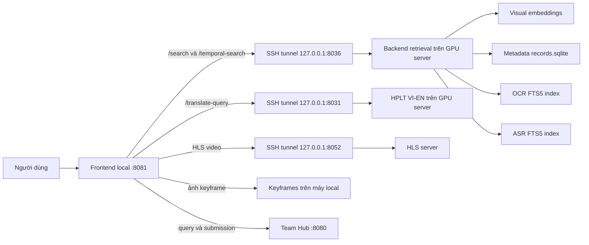

# Tổng quan hệ thống AIC2026 và Temporal Search

## 1. Mục đích của tài liệu

Tài liệu này mô tả hệ thống truy hồi video hiện tại, các model và nguồn dữ liệu đang dùng, đồng thời trình bày chi tiết thuật toán **Temporal Search** trong code. Mục tiêu là cung cấp đủ ngữ cảnh kỹ thuật để thảo luận và đề xuất một phương pháp temporal retrieval tốt hơn.

> Ghi chú quan trọng: implementation hiện tại là tìm kiếm theo từng stage và mở rộng các chuỗi Top-K, gần với **beam search có cắt nhánh**. Nó chưa phải dynamic programming đúng nghĩa, dù một số nhãn trên giao diện đang dùng từ “temporal DP”.

---

## 2. Bài toán hệ thống đang giải quyết

Hệ thống phục vụ tìm kiếm keyframe trong một tập video lớn bằng nhiều loại truy vấn:

- Mô tả nội dung hình ảnh bằng ngôn ngữ tự nhiên.
- Chữ xuất hiện trong hình thông qua OCR.
- Lời thoại trong video thông qua ASR.
- Ảnh mẫu để tìm frame tương tự.
- Chuỗi sự kiện có thứ tự, ví dụ:
  - A: một người mở cửa xe;
  - B: người đó bước vào xe;
  - C: chiếc xe chạy đi.

Kết quả trả về là keyframe hoặc chuỗi keyframe. Từ keyframe, giao diện có thể mở video đúng thời điểm, hiển thị các frame lân cận, OCR và transcript ASR.

---

## 3. Kiến trúc tổng quát



### Phân chia dữ liệu trong cách chạy hiện tại

| Thành phần | Vị trí chính | Vai trò |
|---|---|---|
| Frontend | Máy local, port `8081` | Giao diện và proxy request |
| Keyframe/thumbnail | Máy local | Hiển thị kết quả nhanh, không phải tải từng ảnh qua server |
| Visual model và embedding index | GPU server, tunnel qua `8036` | Mã hóa query và truy hồi vector |
| Metadata | Backend retrieval | Ánh xạ hàng embedding sang video, shot, timestamp và file ảnh |
| OCR index | Backend retrieval | Tìm chữ trong keyframe |
| ASR index | Backend retrieval | Tìm lời thoại và ánh xạ đoạn thoại về frame |
| Model dịch VI-EN | GPU server, tunnel qua `8031` | Dịch query tiếng Việt cho BEiT-3 |
| Video HLS | Server, tunnel qua `8052` | Phát video tại timestamp của keyframe |
| Team Hub | Server, port `8080` | Đồng bộ query, khay và submission giữa thành viên |

Ở chế độ chạy backend hoàn toàn trên local, các đường dẫn resource hiện được khai báo trong `system.local.config.json`, chủ yếu dưới `C:\uit\aic2026_resources`.

---

## 4. Model và phương pháp truy hồi

### 4.1. MetaCLIP-2

- Model: `facebook/metaclip-2-worldwide-b16-384`.
- Dùng cho text-to-image retrieval và image-to-image retrieval.
- Vector có 512 chiều và được chuẩn hóa L2.
- Chạy CUDA với FP16 trong cấu hình hiện tại.
- Backend hiện dùng Torch GPU để tìm kiếm trên ma trận embedding; code cũng có cấu hình cho Milvus.
- Đây là model visual mặc định.

Luồng tìm kiếm cơ bản:

1. Mã hóa câu query thành vector.
2. So sánh với embedding của keyframe.
3. Lấy các vector có độ tương đồng cao nhất.
4. Dùng metadata để trả về `video_id`, `shot_id`, `timestamp_ms`, `keyframe_id` và đường dẫn ảnh.

### 4.2. BEiT-3 Large ITC

- Checkpoint: `beit3_large_itc_patch16_224.pth`.
- Tokenizer: SentencePiece `beit3.spm`.
- Vector có 1024 chiều.
- Độ dài text tối đa hiện tại: 64 token.
- Có embedding index riêng, nhưng dùng chung thứ tự metadata với MetaCLIP-2.
- Model này nhận query tiếng Anh tốt hơn, vì vậy frontend tự dịch query tiếng Việt sang tiếng Anh trước khi retrieval.

Trong một phiên Temporal Search, model visual bị khóa từ Query A. Nếu đổi MetaCLIP-2 sang BEiT-3 hoặc ngược lại thì phải reset và tìm lại từ stage đầu.

### 4.3. Model dịch HPLT

- Model: `HPLT/translate-vi-en-v2.0-hplt_opus`.
- Chạy bản float32, không quantize.
- Beam size hiện dùng: 4.
- Cung cấp API dịch query tiếng Việt sang tiếng Anh tại port server `8031`, được tunnel về `127.0.0.1:8031`.
- Frontend tự gọi dịch trước khi gửi query tới BEiT-3; query tiếng Việt gốc vẫn được giữ để hiển thị.

### 4.4. OCR

Hệ thống hỗ trợ hai nguồn OCR:

- **MonkeyOCR v2**: đang được bật trong cấu hình hiện tại, giữ dấu tiếng Việt.
- **PP-OCRv6/PaddleOCR**: code và index có hỗ trợ, nhưng đang tắt; dữ liệu cũ có thể đã bỏ dấu.

OCR không chạy model trực tiếp mỗi lần search. Text OCR đã được lập chỉ mục trước trong SQLite FTS5. Query-time dùng BM25 để tìm keyframe chứa text phù hợp.

### 4.5. ASR

- Transcript hiện có được sinh trước bằng **ChunkFormer**.
- Query-time không chạy ChunkFormer trực tiếp.
- Các đoạn transcript, timestamp bắt đầu/kết thúc và liên kết đến frame được lưu trong `asr.sqlite`.
- Tìm kiếm ASR dùng SQLite FTS5 và BM25.
- Khi xem video, frontend lấy các đoạn transcript theo timestamp và highlight đoạn tương ứng với frame hiện tại.

Vì ASR là dữ liệu đã tiền xử lý, chất lượng tìm kiếm bị giới hạn bởi transcript ChunkFormer đã nhận dạng được. Nếu một câu bị bỏ sót hoặc timestamp sai thì query-time không thể phục hồi nội dung đó.

---

## 5. Kết hợp các modality

Mỗi stage có thể chứa ba query độc lập:

- Semantic query cho MetaCLIP-2 hoặc BEiT-3.
- OCR query.
- ASR query.

Người dùng điều chỉnh ba trọng số. Mặc định trong backend hiện tại là:

| Thành phần | Trọng số mặc định |
|---|---:|
| Visual/Semantic | 0.59 |
| OCR | 0.41 |
| ASR | 0.00 |

Frontend chuẩn hóa lại các trọng số đang sử dụng để tổng bằng 1.

### 5.1. Fusion giữa Visual và OCR

Điểm visual và BM25 OCR được min-max normalize riêng trên tập kết quả. Sau đó code dùng weighted harmonic fusion:

$$
S_{VO} = \frac{1}{\frac{w_v}{S_v + \epsilon} + \frac{w_o}{S_o + \epsilon}}
$$

Trong đó:

- $S_v$ là điểm visual sau min-max normalization.
- $S_o$ là điểm OCR sau min-max normalization.
- $w_v, w_o$ được chuẩn hóa để có tổng bằng 1.
- $\epsilon = 10^{-6}$.

Cách này phạt mạnh frame chỉ tốt ở một modality nhưng rất yếu ở modality còn lại.

### 5.2. Fusion thêm ASR

ASR được ghép với kết quả Visual/OCR bằng weighted Reciprocal Rank Fusion:

$$
S_{RRF}(x) = \frac{w_b}{k+r_b(x)} + \frac{w_a}{k+r_a(x)}
$$

Với:

- $k=60$.
- $r_b$ là rank từ kết quả nền Visual/OCR.
- $r_a$ là rank ASR.
- $w_b$ và $w_a$ là trọng số nền và ASR.

Điểm cuối được chia cho điểm lớn nhất trong danh sách để đưa về khoảng gần `[0,1]`.

### Nhận xét về calibration

Hệ thống đang kết hợp hai cơ chế khác nhau:

- Visual + OCR dùng min-max và harmonic fusion.
- Kết quả trên + ASR dùng rank fusion.

Vì vậy, ý nghĩa của cùng một giá trị trọng số chưa hoàn toàn đồng nhất giữa ba modality. Đây là một hướng đáng xem xét khi cải tiến.

---

## 6. Temporal Search hiện tại

### 6.1. Mục tiêu

Temporal Search tìm một chuỗi sự kiện có thứ tự trong cùng video:

$$
A \rightarrow B \rightarrow C
$$

Mỗi sự kiện có thể sử dụng semantic query, OCR query, ASR query hoặc kết hợp cả ba.

Backend hiện hỗ trợ tối đa **3 stage**. Mỗi stage tương ứng một cảnh trong chuỗi. Giao diện cũng tự tạo lần lượt Query A, B và C.

### 6.2. Tham số hiện tại

| Tham số | Giá trị | Ý nghĩa |
|---|---:|---|
| `stage1_top_k` | 200 | Số anchor giữ lại ở Query A |
| `local_top_k` | 200 | Số kết quả cục bộ tối đa cho mỗi chuỗi cha |
| `stage2_keep_k` | 200 | Số chuỗi giữ lại sau Query B |
| `output_top_k` | 200 | Số chuỗi cuối sau Query C |
| `temporal_window_ms` | 300000 ms | Sự kiện kế tiếp phải nằm trong 5 phút sau anchor |
| `session_ttl_seconds` | 1800 s | Phiên temporal hết hạn sau 30 phút không hoạt động |
| `max_sessions` | 64 | Số phiên temporal tối đa trong RAM |

### 6.3. Tiền xử lý metadata

Khi backend khởi tạo Temporal Search:

1. Đọc toàn bộ metadata keyframe.
2. Loại các row đã bị đánh dấu deleted.
3. Nhóm row theo `video_id`.
4. Sắp xếp từng video theo `(timestamp_ms, row_id)`.
5. Lưu hai mảng NumPy cho mỗi video:
   - danh sách timestamp;
   - danh sách row ID tương ứng.

Nhờ dữ liệu đã sắp xếp, code dùng `numpy.searchsorted` để lấy nhanh cửa sổ frame ở phía sau một anchor.

### 6.4. Stage 1: tìm anchor A

1. Mã hóa semantic query một lần nếu trọng số semantic lớn hơn 0.
2. Search trên toàn bộ collection, hoặc chỉ trong `video_id` nếu người dùng đã lọc video.
3. Kết hợp Visual, OCR và ASR theo các trọng số của stage A.
4. Giữ tối đa 200 kết quả.
5. Mỗi kết quả được chuyển thành một chuỗi một phần tử:

$$
P_A = [a_i]
$$

Điểm chuỗi lúc này bằng `normalized_score` của anchor.

### 6.5. Stage 2: nối B vào từng anchor A

Với mỗi chuỗi cha `[a_i]`:

1. Lấy cảnh cuối làm anchor.
2. Chỉ lấy frame:
   - cùng `video_id`;
   - có timestamp lớn hơn timestamp anchor;
   - có timestamp nhỏ hơn hoặc bằng `anchor + 300000 ms`.
3. Chạy retrieval B chỉ trên tập candidate trong cửa sổ đó.
4. Lấy tối đa 200 kết quả B cho mỗi anchor.
5. Tạo các chuỗi `[a_i, b_j]`.
6. Tính điểm chuỗi bằng harmonic mean của điểm hai cảnh.
7. Gộp chuỗi trùng theo tuple `keyframe_id`, giữ phiên bản có điểm cao hơn.
8. Sắp xếp và chỉ giữ 200 chuỗi tốt nhất.

### 6.6. Stage 3: nối C

Stage 3 lặp lại cùng quy trình trên 200 chuỗi `[A,B]` đã giữ lại:

- Anchor mới là cảnh B, không phải cảnh A.
- C phải ở sau B và cách B không quá 5 phút.
- Kết quả là chuỗi `[A,B,C]`.
- Giữ tối đa 200 chuỗi cuối.

Điều kiện thời gian áp dụng theo từng cặp liên tiếp:

$$
0 < t_B-t_A \leq W
$$

$$
0 < t_C-t_B \leq W
$$

với $W=300$ giây. Tổng span từ A đến C có thể lớn hơn 300 giây, tối đa gần 600 giây theo điều kiện hiện tại.

### 6.7. Điểm của chuỗi

Với chuỗi gồm $n$ cảnh có normalized score $s_1, s_2, ..., s_n$, điểm chuỗi là harmonic mean:

$$
S_{seq} = \frac{n}{\sum_{i=1}^{n}\frac{1}{s_i}}
$$

Nếu bất kỳ $s_i \leq 0$, điểm chuỗi bằng 0.

Harmonic mean khiến một cảnh có điểm thấp kéo mạnh toàn bộ chuỗi xuống. Nó phù hợp nếu mọi bước A, B, C đều bắt buộc phải tốt, nhưng có thể quá nhạy khi một stage khó hoặc điểm giữa các modality chưa được calibration tốt.

### 6.8. Pseudocode gần với implementation

```text
START(query_A):
    candidates_A = all frames or frames of selected video
    hits_A = retrieve_and_fuse(query_A, candidates_A, top_k=200)
    beam = [[a] for a in hits_A]
    save session

CONTINUE(query_stage):
    encode semantic query once
    next_beam = {}

    for sequence in beam:
        anchor = sequence.last_scene
        local_candidates = frames in same video where:
            anchor.time < frame.time <= anchor.time + 5 minutes

        local_hits = retrieve_and_fuse(
            query_stage,
            local_candidates,
            top_k=200
        )

        for hit in local_hits:
            new_sequence = sequence + hit
            score = harmonic_mean(scene.normalized_score for scene in new_sequence)
            deduplicate by tuple(keyframe_id)

    beam = best 200 sequences by score
    save session
```

### 6.9. Cách xếp hạng khi bằng điểm

Chuỗi được sort lần lượt theo:

1. `sequence_score` giảm dần.
2. Điểm normalized của cảnh cuối giảm dần.
3. `video_id`.
4. Tuple timestamp của toàn bộ chuỗi.

### 6.10. Session và thao tác sửa query

Backend giữ session trong RAM với các action:

- `start`: chạy Query A và tạo session mới.
- `continue`: chạy stage tiếp theo.
- `replace`: chạy lại stage 2 hoặc 3 từ kết quả của stage trước, sau đó bỏ các stage phía sau.
- `reset`: xóa session.

Nếu backend restart, session temporal hiện tại mất. Phiên cũng tự hết hạn sau 30 phút.

---

## 7. Đánh giá implementation Temporal Search hiện tại

### Ưu điểm

- Điều kiện thứ tự thời gian rõ ràng và dễ kiểm soát.
- Candidate của stage sau luôn nằm trong cùng video.
- `searchsorted` giúp lọc cửa sổ timestamp nhanh.
- Query embedding được tính một lần cho mỗi stage rồi tái sử dụng.
- Có thể phối hợp semantic, OCR và ASR riêng cho từng sự kiện.
- Harmonic mean yêu cầu toàn bộ chuỗi cùng đạt chất lượng tương đối tốt.
- Cấu trúc session cho phép người dùng tìm A, xem kết quả, rồi mới nhập B và C.

### Hạn chế và rủi ro bỏ sót

#### 1. Cắt Top-K sớm

Chỉ 200 anchor A được giữ lại. Một A có điểm không cao nhưng ghép được với B và C rất tốt sẽ không bao giờ được xem xét nếu đã bị loại ở stage đầu. Tương tự, stage B bị cắt còn 200 chuỗi trước khi tìm C.

#### 2. Mở rộng cục bộ lặp lại nhiều lần

Stage B có thể chạy tới 200 lần local retrieval, mỗi lần cho một anchor A. Các cửa sổ của nhiều anchor có thể chồng lấn mạnh, dẫn tới chấm lại nhiều frame giống nhau.

#### 3. Chưa phải dynamic programming

Không có bảng trạng thái theo video/timestamp và không tái sử dụng nghiệm con tối ưu giữa các anchor. Implementation đang enumerate rồi prune giống beam search.

#### 4. Cửa sổ thời gian cố định

Mọi cặp sự kiện dùng cùng cửa sổ 5 phút. Một số quan hệ chỉ hợp lý trong vài giây, trong khi quan hệ khác cần nhiều phút. Không có `min_gap`, `max_gap` riêng cho từng cặp A-B hoặc B-C.

#### 5. Không có transition score

Điểm chuỗi chỉ dựa vào điểm relevance từng cảnh. Hệ thống chưa chấm:

- độ hợp lý của khoảng thời gian;
- hai frame có thuộc cùng shot hay hai shot hợp lý hay không;
- mức thay đổi nội dung giữa hai sự kiện;
- độ liên tục của nhân vật, vật thể hoặc bối cảnh.

#### 6. Có thể chọn các frame gần như trùng nhau

Chỉ yêu cầu timestamp tăng nghiêm ngặt. Không có minimum gap, temporal NMS hay ràng buộc shot khác nhau, nên A và B có thể là hai keyframe gần nhau của cùng một hình ảnh.

#### 7. Điểm giữa stage và modality chưa được calibration thống nhất

Cosine similarity, BM25, min-max score và RRF mang ý nghĩa khác nhau. Harmonic mean trên `normalized_score` có thể ưu tiên hoặc phạt một modality ngoài ý muốn.

#### 8. Keyframe sampling giới hạn độ chính xác thời gian

Thuật toán chỉ thao tác trên keyframe đã trích xuất. Sự kiện ngắn nằm giữa hai keyframe có thể bị bỏ sót. Timestamp của OCR/ASR cũng phải được ánh xạ về keyframe gần nhất.

#### 9. Chỉ hỗ trợ chiều tiến và tối đa ba stage

Backend hiện chỉ cho A → B → C. Chưa có tìm hai chiều quanh anchor, truy vấn nhiều hơn ba bước, sự kiện tùy chọn, sự kiện phủ định hoặc thứ tự không hoàn toàn.

#### 10. Session nằm trong RAM

Restart backend làm mất session. Giới hạn hiện tại là 64 session và TTL 30 phút.

---

## 8. Các hướng cải tiến nên phân tích

### Cải tiến ít thay đổi kiến trúc

1. Thêm `min_gap_ms` và `max_gap_ms` riêng cho từng cặp stage.
2. Thêm temporal NMS để loại chuỗi gần trùng nhau.
3. Yêu cầu stage kế tiếp thuộc shot khác hoặc cách anchor tối thiểu một số frame.
4. Calibration score từng modality trên tập validation trước khi fusion.
5. Batch hoặc cache local candidate windows bị chồng lấn.
6. Tăng beam thích ứng: giữ nhiều ứng viên hơn ở stage đầu nếu query mơ hồ.
7. Dùng weighted geometric mean hoặc log-score thay harmonic mean để dễ điều chỉnh độ phạt.
8. Thêm diversity theo video, shot và timestamp vào Top-K.

### Thay đổi thuật toán

1. **Dynamic programming theo từng video**: lấy Top-N candidate độc lập cho mỗi stage, sau đó nối các node thỏa điều kiện thời gian và tìm đường đi có tổng score tốt nhất.
2. **Viterbi / shortest path trên DAG**: mỗi candidate là node, cạnh biểu diễn chuyển tiếp hợp lệ A→B hoặc B→C.
3. **Beam search toàn cục**: tìm candidate từng stage một lần trên collection, group theo video, rồi mở rộng beam bằng join timestamp thay vì chạy retrieval lại cho từng anchor.
4. **Interval join bằng two pointers/searchsorted**: nối danh sách candidate đã sort theo thời gian với độ phức tạp thấp hơn.
5. **Learned transition model**: học điểm chuyển tiếp từ độ chênh timestamp, shot boundary, visual continuity và object/person consistency.
6. **Late interaction hoặc reranker**: dùng model mạnh hơn chỉ rerank vài trăm chuỗi cuối.
7. **Adaptive temporal window**: model hoặc heuristic chọn cửa sổ dựa trên loại hành động trong query.
8. **Bidirectional temporal search**: cho phép tìm quanh một anchor mạnh ở B rồi mở rộng về A và C.

---

## 9. Tiêu chí đánh giá phương pháp mới

Không nên chỉ đo thời gian chạy. Có thể đánh giá:

- Recall@K của chuỗi đúng.
- MRR hoặc nDCG của chuỗi đúng.
- Tỷ lệ cả A, B, C cùng đúng.
- Sai số timestamp của từng stage.
- Tỷ lệ chuỗi có frame lặp hoặc cùng shot không mong muốn.
- Số lần chấm lại cùng một candidate.
- Latency stage A, B, C và latency toàn phiên.
- VRAM/RAM sử dụng.
- Độ nhạy với `top_k`, temporal window và trọng số fusion.
- Chất lượng theo từng loại query: visual, OCR, ASR và hybrid.

Cần có tập ground truth gồm chuỗi `(video_id, timestamp_A, timestamp_B, timestamp_C)` và khoảng chấp nhận cho từng timestamp.

---

## 10. Prompt gợi ý để đưa cho ChatGPT

```text
Hãy đọc mô tả hệ thống và Temporal Search trong tài liệu này như một bài toán
multi-stage video retrieval. Implementation hiện tại là staged beam expansion có
Top-K pruning, không phải dynamic programming thật sự.

Tôi muốn bạn:
1. Phân tích nguyên nhân thuật toán hiện tại có thể bỏ sót chuỗi A→B→C đúng.
2. Đề xuất ít nhất 3 phương án thay thế, gồm:
   - một phương án ít sửa code;
   - một phương án dùng dynamic programming/DAG;
   - một phương án ưu tiên chất lượng retrieval cao nhất.
3. Viết công thức scoring cho node relevance và transition score.
4. Nêu cách kết hợp điểm Visual, OCR và ASR khi các score chưa cùng calibration.
5. Phân tích độ phức tạp thời gian, bộ nhớ và khả năng chạy trên khoảng 377 nghìn
   keyframe, Top-K hiện tại là 200.
6. Đưa pseudocode đủ cụ thể để thay thế backend/app/temporal_search.py.
7. Đề xuất cách giảm chuỗi gần trùng nhau và tránh chọn A, B, C từ cùng một shot.
8. Đề xuất ablation study và metric đánh giá.

Hãy tách rõ:
- cải tiến có thể triển khai nhanh;
- thay đổi thuật toán lớn;
- phần cần dữ liệu huấn luyện hoặc ground truth.

Không giả định hệ thống có component chưa được mô tả. Nếu cần thêm thông tin, hãy
nêu giả định cụ thể trước khi kết luận.
```

---

## 11. File code liên quan

- `backend/app/temporal_search.py`: toàn bộ session, cửa sổ thời gian, mở rộng chuỗi và sequence scoring.
- `backend/app/lazy_server.py`: endpoint `/search`, `/temporal-search`, tải model/index và fusion pipeline.
- `backend/app/embedder.py`: MetaCLIP-2 và BEiT-3 text encoder.
- `backend/app/ocr.py`: OCR FTS5/BM25 và Visual-OCR fusion.
- `backend/app/asr.py`: ASR FTS5/BM25, ánh xạ transcript về frame và RRF fusion.
- `frontend/app.js`: tạo stage A/B/C, dịch query BEiT-3 và gửi request temporal.
- `frontend/serve_frontend.py`: proxy từ frontend đến backend, HLS và translator.
- `system.config.json`: cấu hình mặc định.
- `system.local.config.json`: đường dẫn resource và URL khi chạy local/member.

## 12. Tóm tắt ngắn

Hệ thống dùng MetaCLIP-2 hoặc BEiT-3 để tìm nội dung hình ảnh, MonkeyOCR FTS5 để tìm chữ và ChunkFormer ASR FTS5 để tìm lời thoại. Temporal Search tìm A trước, sau đó với từng kết quả A tìm B trong cùng video và trong 5 phút kế tiếp; tiếp tục tương tự từ B sang C. Chuỗi được chấm bằng harmonic mean và cắt còn Top-200 sau mỗi stage. Thiết kế dễ hiểu và dùng được trong tương tác, nhưng có nguy cơ bỏ sót do cắt Top-K sớm, local search lặp lại, cửa sổ cố định và thiếu transition score. Hướng tự nhiên để cải tiến là tạo candidate cho từng stage một lần, nối chúng thành DAG theo timestamp, rồi dùng dynamic programming hoặc k-best path để xếp hạng chuỗi.
